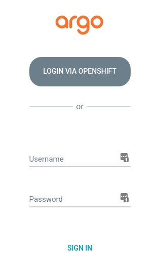
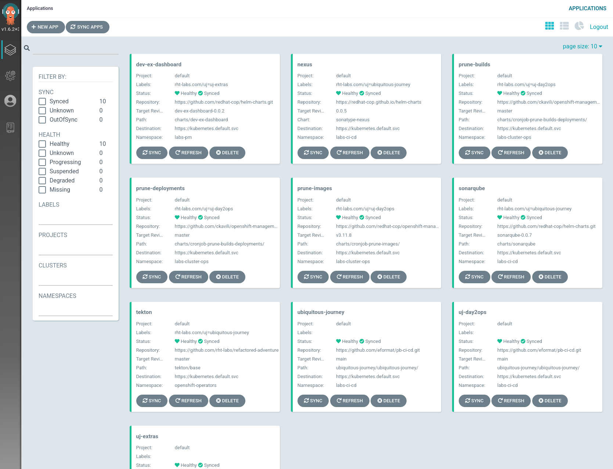
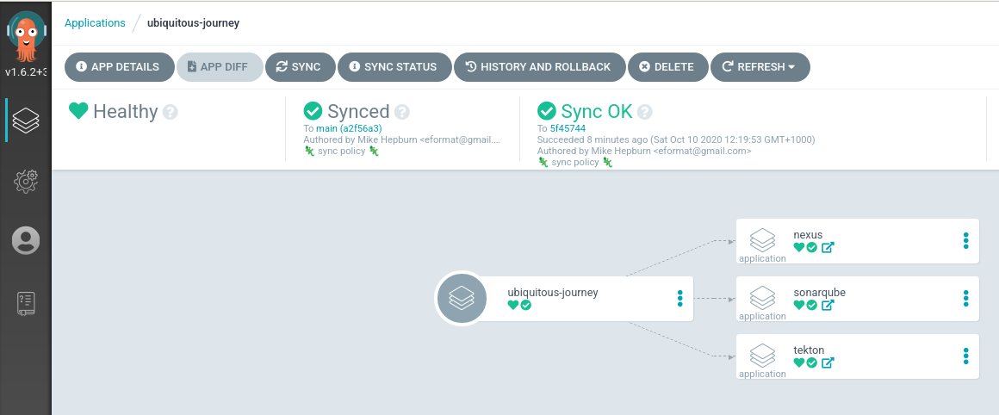
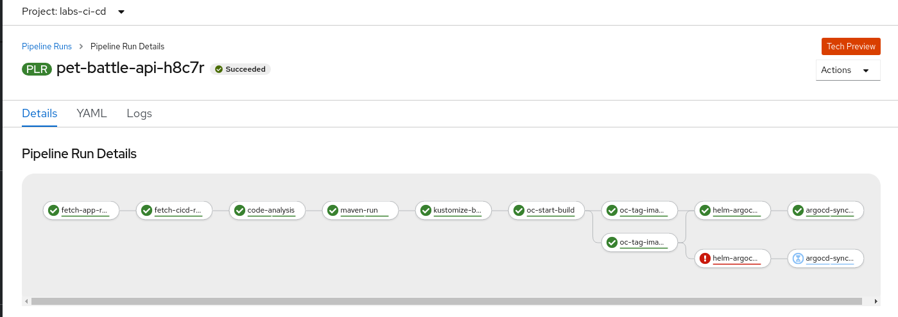
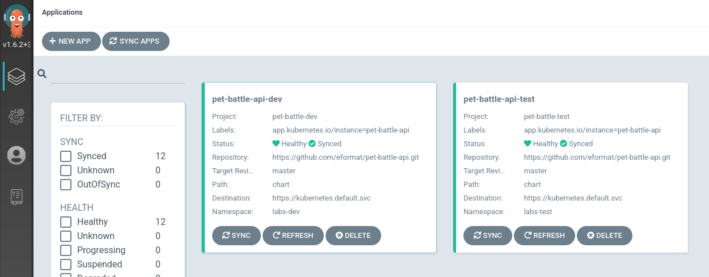
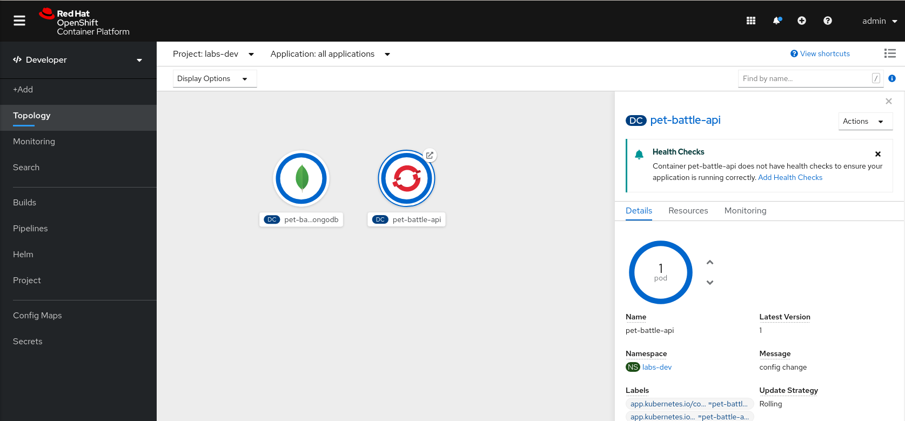
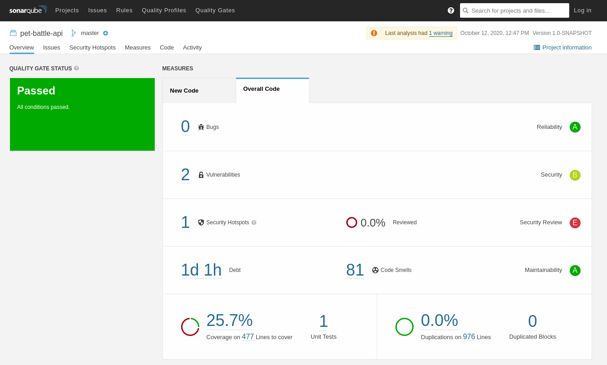
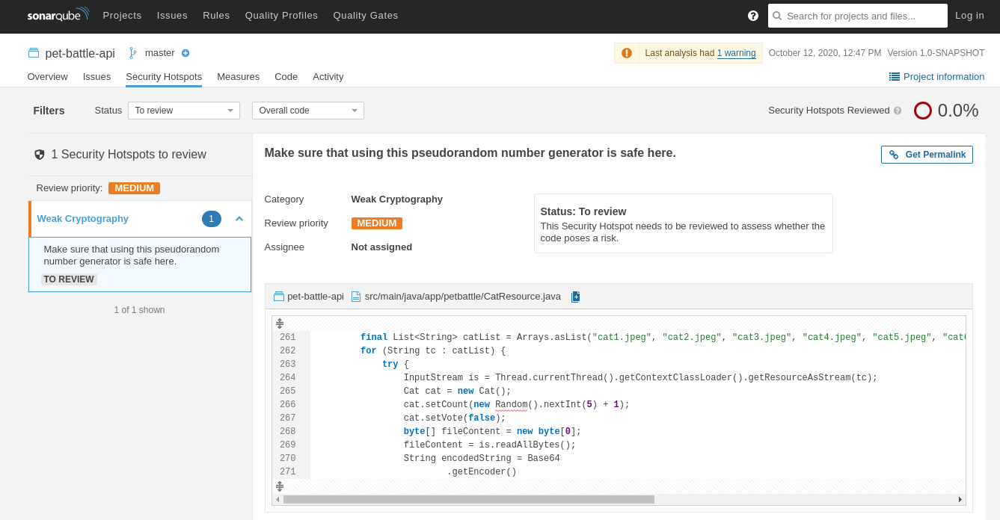
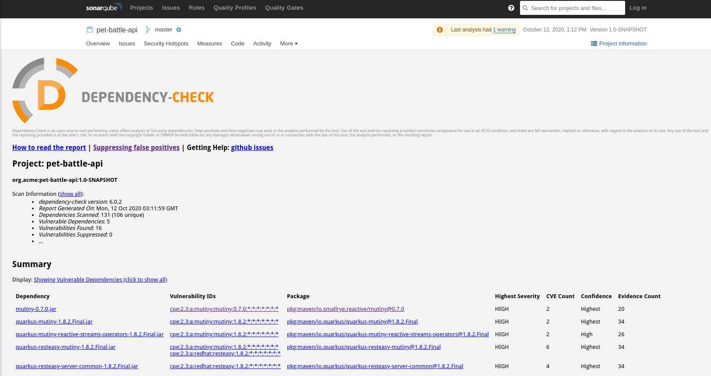

## pb-ci-cd

An end to end tutorial for using Ubiquitous Journey in your own project with Tekton pipelines.

This example uses the Java Quarkus pet battle applications as an example. 

We scaffold from scratch the pieces required to run a CI/CD pipeline including build, deploy, code quality checking.

### Bootstrap your CI/CD environment
Create a directory to hold your CICD tooling automation.
```bash
mkdir pb-ci-cd
```

Document all the things here:
```bash
cd pb-ci-cd && touch README.md
```

Clone UJ into your project:
```bash
git clone https://github.com/rht-labs/ubiquitous-journey
rm -rf ubiquitous-journey/.git/
rm -rf ubiquitous-journey/.github
```

Initialize git repository in the top level folder.
```bash
git init
git add README.md
git commit -m  "🐪 initial commit 🐪"
git branch -M main
git remote add origin git@github.com:eformat/pb-ci-cd.git
git push -u origin main
```

#### [ubiquitous-journey/ubiquitous-journey/values-tooling.yaml](ubiquitous-journey/ubiquitous-journey/values-tooling.yaml)

Edit this file and choose tools we want by enabling them as `true` (the rest we set to false). In this example we are using nexus, sonarqube and tekton:
```bash

enabled: true

- nexus
- sonarqube
- tekton
```

Set `sonarqube plugins values`
```yaml
    values:
      initContainers: true
      plugins:
        install:
          - https://github.com/checkstyle/sonar-checkstyle/releases/download/8.35/checkstyle-sonar-plugin-8.35.jar
          - https://repo1.maven.org/maven2/org/sonarsource/java/sonar-java-plugin/6.3.2.22818/sonar-java-plugin-6.3.2.22818.jar
          - https://repo1.maven.org/maven2/org/sonarsource/jacoco/sonar-jacoco-plugin/1.1.0.898/sonar-jacoco-plugin-1.1.0.898.jar
          - https://github.com/dependency-check/dependency-check-sonar-plugin/releases/download/2.0.6/sonar-dependency-check-plugin-2.0.6.jar
```

#### [ubiquitous-journey/ubiquitous-journey/values-extratooling.yaml](ubiquitous-journey/ubiquitous-journey/values-extratooling.yaml)

Edit this file and set all of these to false (we dont need them for now).

#### [ubiquitous-journey/argo-app-of-apps.yaml](ubiquitous-journey/argo-app-of-apps.yaml)

Replace source with new git repo, github now uses main instead of master and fix path:
```bash
sed -i -e 's|rht-labs/ubiquitous-journey|eformat/pb-ci-cd|' ubiquitous-journey/argo-app-of-apps.yaml
sed -i -e 's|source_ref: master|source_ref: main|' ubiquitous-journey/argo-app-of-apps.yaml
sed -i -e 's|source_path: ubiquitous-journey|source_path: ubiquitous-journey/ubiquitous-journey|' ubiquitous-journey/argo-app-of-apps.yaml
sed -i -e 's|sync_policy_automated: false|sync_policy_automated: true|' ubiquitous-journey/argo-app-of-apps.yaml
```

Check all of it into git:
```bash
git add .
git commit -m  "🐪 initial commit 🐪"
git push
```

#### Bootstrap

Login to openshift as a user with `cluster-admin`
```bash
oc login
cd pb-ci-cd/ubiquitous-journey
```

Boostrap ArgoCD (run this command again if you see a `no matches for kind "ArgoCD" in version "argoproj.io/v1alpha1"` warning - this is fine, the CR was not found yet)
```bash
$ helm template bootstrap --dependency-update -f bootstrap/values-bootstrap.yaml bootstrap | oc apply -f-

namespace/labs-ci-cd unchanged
namespace/labs-pm unchanged
namespace/labs-cluster-ops unchanged
namespace/labs-dev unchanged
namespace/labs-test unchanged
namespace/labs-staging unchanged
serviceaccount/jenkins unchanged
secret/argocd-privaterepo configured
clusterrole.rbac.authorization.k8s.io/labs-ci-cd-argocd-application-controller unchanged
clusterrolebinding.rbac.authorization.k8s.io/labs-ci-cd-argocd-application-controller unchanged
argocd.argoproj.io/argocd created
operatorgroup.operators.coreos.com/labs-ci-cd unchanged
subscription.operators.coreos.com/prometheus-operator unchanged
subscription.operators.coreos.com/argocd-operator unchanged
rolebinding.rbac.authorization.k8s.io/labs-devs_edit_role unchanged
rolebinding.rbac.authorization.k8s.io/labs-admins_admin_role unchanged
rolebinding.rbac.authorization.k8s.io/jenkins_admin_role unchanged
rolebinding.rbac.authorization.k8s.io/labs-devs_edit_role unchanged
rolebinding.rbac.authorization.k8s.io/labs-admins_admin_role unchanged
rolebinding.rbac.authorization.k8s.io/jenkins_admin_role unchanged
rolebinding.rbac.authorization.k8s.io/labs-devs_edit_role unchanged
rolebinding.rbac.authorization.k8s.io/labs-admins_admin_role unchanged
rolebinding.rbac.authorization.k8s.io/jenkins_admin_role unchanged
rolebinding.rbac.authorization.k8s.io/labs-devs_edit_role unchanged
rolebinding.rbac.authorization.k8s.io/labs-admins_admin_role unchanged
rolebinding.rbac.authorization.k8s.io/jenkins_admin_role unchanged
rolebinding.rbac.authorization.k8s.io/labs-devs_edit_role unchanged
rolebinding.rbac.authorization.k8s.io/labs-admins_admin_role unchanged
rolebinding.rbac.authorization.k8s.io/jenkins_admin_role unchanged
rolebinding.rbac.authorization.k8s.io/labs-devs_edit_role unchanged
rolebinding.rbac.authorization.k8s.io/labs-admins_admin_role unchanged
rolebinding.rbac.authorization.k8s.io/jenkins_admin_role unchanged
```

You should see your pods and deployments spinning up:


Give me ALL THE TOOLS, EXTRAS & OPSY THINGS !
```bash
$ helm template -f argo-app-of-apps.yaml ubiquitous-journey/ | oc -n labs-ci-cd apply -f-

application.argoproj.io/ubiquitous-journey created
application.argoproj.io/uj-extras created
application.argoproj.io/uj-day2ops created
```

### Check out deployments in UI

Find the argocd Route in the labs-ci-cd namespace `argocd-server`


Browse to it and login via OpenShift


All the apps should be syncing and deploying (we set auto sync true):


If you select one of the `app-of-app` applications e.g. `ubiquitous-journey` we can see out CICD tooling deployed. You can further drill-down from here as well.


### Create Tekton directory structure

To hold all of the Tekton assets create the following directory structure in the `pb-ci-cd` folder

```bash
mkdir -p applications operators persistent-volume-claims pipelines rolebindings secrets tasks templates triggers
```


### Copy pre-defined artefacts

We wish to assemble pipeline artefacts. We can copy previous examples or source new ones from
- https://hub-preview.tekton.dev

#### PVC

We want to use [tekton workspaces](https://tekton.dev/docs/pipelines/workspaces/) to hold our build artefacts, so we first copy in Persistent Volume Claim definitions. We use RWX file systems to we can run parallel tasks using the same file system.

Prerequisites:
- AWS EFS storage class is configured on your cluster:
- https://docs.openshift.com/container-platform/4.5/storage/persistent_storage/persistent-storage-efs.html
- 
```bash
curl https://raw.githubusercontent.com/tripvibe/tv-ci-cd/master/persistent-volume-claims/build-images.yaml -o persistent-volume-claims/build-images.
yaml
curl https://raw.githubusercontent.com/tripvibe/tv-ci-cd/master/persistent-volume-claims/maven-source.yaml -o persistent-volume-claims/maven-source.yaml
curl https://raw.githubusercontent.com/tripvibe/tv-ci-cd/master/persistent-volume-claims/kustomization.yaml -o persistent-volume-claims/kustomization.yaml
```

### RBAC

We want our Tekton `pipeline` service account to be able to tag images in our namespaces.
```bash
curl https://raw.githubusercontent.com/tripvibe/tv-ci-cd/master/rolebindings/edit-0.yaml -o rolebindings/edit-0.yaml

cat <<EOF > rolebindings/kustomization.yaml
apiVersion: kustomize.config.k8s.io/v1beta1
kind: Kustomization

resources:
- edit-0.yaml
EOF
```

### Tasks

[Tasks](https://tekton.dev/docs/pipelines/tasks/) make up the steps in our pipeline.

```bash
curl https://raw.githubusercontent.com/tektoncd/catalog/master/task/git-clone/0.2/git-clone.yaml -o tasks/git-clone.yaml
curl https://raw.githubusercontent.com/tripvibe/tv-ci-cd/master/tasks/helm-template-from-source.yaml -o tasks/helm-template-from-source.yaml
curl https://raw.githubusercontent.com/tripvibe/tv-ci-cd/master/tasks/openshift-client.yaml -o tasks/openshift-client.yaml
curl https://raw.githubusercontent.com/tripvibe/tv-ci-cd/master/tasks/openshift-kustomize.yaml -o tasks/openshift-kustomize.yaml
curl https://raw.githubusercontent.com/tripvibe/tv-ci-cd/master/tasks/maven.yaml -o tasks/maven.yaml
curl https://raw.githubusercontent.com/tripvibe/tv-ci-cd/master/tasks/argocd-sync-and-wait.yaml -o tasks/argocd-sync-and-wait.yaml
```

Create a kustomization file:
```bash
cat <<EOF > tasks/kustomization.yaml
apiVersion: kustomize.config.k8s.io/v1beta1
kind: Kustomization

resources:
- git-clone.yaml
- maven.yaml
- openshift-client.yaml
- openshift-kustomize.yaml
- helm-template-from-source.yaml
- argocd-sync-and-wait.yaml
EOF
```

### Secrets

We need to create an ArgoCD auth token and mount that as a secret for our pipeline to use. For now we are going to just use Kubernetes secrets which are not very secret, so we won't check this into the `secret/` folder for now but just create it in our namespace.

Get a token for the admin user (substitute your openshift username here):
```bash
oc project labs-ci-cd
oc edit cm argocd-cm

data:
  accounts.admin: apiKey

HOST=$(oc get route argocd-server --template='{{ .spec.host }}')
argocd login $HOST:443 --sso --insecure --username admin
TOKEN=$(argocd account generate-token --account admin)

cat <<EOF | oc apply -f -
apiVersion: v1
kind: Secret
metadata:
  name: argocd-env
  namespace: labs-ci-cd
data:
  ARGOCD_TOKEN: "$(echo -n ${TOKEN} | base64 -w0)"
EOF
```

### Applications

We are going to deploy out application using the Helm chart that is part of the application. This chart does not contain a kubernetes `BuildConfig`, so we need to create that here. Our pipeline will create this resource for us.

Create a directory to hold build artifacts:
```bash
mkdir -p applications/build/pet-battle-api
```

Create ImageStream and BuildConfig for out `pet-battle-api` application:
```bash
cat <<EOF > applications/build/pet-battle-api/is.yaml
apiVersion: image.openshift.io/v1
kind: ImageStream
metadata:
  annotations:
    openshift.io/generated-by: OpenShiftNewBuild
  creationTimestamp: null
  labels:
    app: pet-battle-api
  name: pet-battle-api
spec:
  lookupPolicy:
    local: false
status:
  dockerImageRepository: ""
EOF

cat <<EOF > applications/build/pet-battle-api/bc.yaml
apiVersion: build.openshift.io/v1
kind: BuildConfig
metadata:
  annotations:
    openshift.io/generated-by: OpenShiftNewBuild
  creationTimestamp: null
  labels:
    app: pet-battle-api
  name: pet-battle-api
spec:
  nodeSelector: null
  output:
    to:
      kind: ImageStreamTag
      name: pet-battle-api:latest
  postCommit: {}
  runPolicy: "Parallel"
  resources: {}
  source:
    binary: {}
    type: Binary
  strategy:
    dockerStrategy: {dockerfilePath: Dockerfile.jvm}
    type: Docker
  triggers:
  - github:
      secret: O2vVInuS2QkdCm4JnsvT
    type: GitHub
  - generic:
      secret: SPcld7SlEp9-wdHhGi1E
    type: Generic
status:
  lastVersion: 0
EOF

cat <<EOF > applications/build/pet-battle-api/kustomization.yaml
apiVersion: kustomize.config.k8s.io/v1beta1
kind: Kustomization

bases:
- is.yaml
- bc.yaml

namespace: labs-ci-cd
EOF

cat <<EOF > applications/build/kustomization.yaml
apiVersion: kustomize.config.k8s.io/v1beta1
kind: Kustomization

bases:
- pet-battle-api
EOF
```

Now, we also need to create our app-of-apps argocd definition - which is a helm chart.

Create a directory to hold build artifacts:
```bash
mkdir -p applications/deployment/templates
```

Copy in existing artifacts:
```bash
curl https://raw.githubusercontent.com/tripvibe/tv-ci-cd/master/applications/deployment/templates/_helpers.tpl -o applications/deployment/templates/_helpers.tpl
curl https://raw.githubusercontent.com/tripvibe/tv-ci-cd/master/applications/deployment/templates/argoapplicationdeploy.yaml -o applications/deployment/templates/argoapplicationdeploy.yaml
curl https://raw.githubusercontent.com/tripvibe/tv-ci-cd/master/applications/deployment/templates/argocd-project.yaml -o applications/deployment/templates/argocd-project.yaml
curl https://raw.githubusercontent.com/tripvibe/tv-ci-cd/master/applications/deployment/.helmignore -o applications/deployment/.helmignore

cat <<EOF > applications/deployment/Chart.yaml
apiVersion: v1
name: pb-api-deploy
description: pet battle api deployment
type: application
version: 0.0.1
appVersion: 0.0.1
EOF
```

Specify the values we want for our `pet-battle-api` in each environment (namespace) in this file `values-applications.yaml`
```bash
cat <<EOF > applications/deployment/values-applications.yaml
##############
# Application Custom Values
#############
pet_battle_api_values: &pet_battle_api_values
  fullnameOverride: pet-battle-api # important to use this if want same app name in multiple ns, else release.name used in chart
  image_repository: image-registry.openshift-image-registry.svc:5000
  image_name: pet-battle-api
dev_allowed_destinations: &dev_allowed_destinations # argocd project
  - namespace: labs-dev
    server: https://kubernetes.default.svc
test_allowed_destinations: &test_allowed_destinations # argocd project
  - namespace: labs-test
    server: https://kubernetes.default.svc

##############
# Argo Ignore Differences
#############
ignore_differences: &ignore_differences
  ignoreDifferences:
  - group: apps.openshift.io
    kind: DeploymentConfig
    jsonPointers:
    - /spec/replicas
    - /spec/template/spec/containers/0/image
    - /spec/triggers/0/imageChangeParams/lastTriggeredImage
    - /spec/triggers/1/imageChangeParams/lastTriggeredImage

##############
# Argo App of Apps declaration
#############
argocd_projects:
- enabled: true
  name: pet-battle-dev
  destinations: *dev_allowed_destinations
- enabled: true
  name: pet-battle-test
  destinations: *test_allowed_destinations

applications:
  pet_battle_api_dev:
    name: pet-battle-api-dev
    enabled: false # overridden by pipeline
    source: https://github.com/eformat/pet-battle-api.git
    source_path: chart
    sync_policy_automated: true
    destination: labs-dev
    source_ref: master # overridden by git revision in pipeline trigger
    values: *pet_battle_api_values
    ignore_differences: *ignore_differences
    project:
      name: pet-battle-dev
      enabled: true
  pet_battle_api_test:
    name: pet-battle-api-test
    enabled: false # overridden by pipeline
    source: https://github.com/eformat/pet-battle-api.git
    source_path: chart
    sync_policy_automated: true
    destination: labs-test
    source_ref: master # overridden by git revision in pipeline trigger
    values: *pet_battle_api_values
    ignore_differences: *ignore_differences
    project:
      name: pet-battle-test
      enabled: true
EOF
```

### Conditionals (deprecated)

Conditions in tasks are replaced by `when` upstream in tekton,but for now:
```bash
curl https://raw.githubusercontent.com/tripvibe/tv-ci-cd/master/conditionals/is-equal.yaml -o conditionals/is-equal.yaml
curl https://raw.githubusercontent.com/tripvibe/tv-ci-cd/master/conditionals/is-not-equal.yaml -o conditionals/is-not-equal.yaml
curl https://raw.githubusercontent.com/tripvibe/tv-ci-cd/master/conditionals/kustomization.yaml -o conditionals/kustomization.yaml
```

### Pipeline

We are going to create our pipeline definition which knows how to build our application. The pipeline steps are:

| Task                    | Description |
|-------------------------|-------------------------------------------------------------------------------------|
|`fetch-app-repository`|checkout our application git repo (main/pr/branch)|
|`fetch-cicd-repository`|checkout this ci-cd repository (main)|
|`code-analysis`|code quality check using sonarqube (test coverage, bugs, code smells, dependency CVE check)|
|`maven-run`|build the application|
|`kustomize-build-config`|apply build config using kustomize to cluster|
|`oc-start-build`|start oci container build in openshift using Dockerfile from the source code (UBI base image)|
|`oc-tag-image-dev`|tag built image into our development namespace|
|`oc-tag-image-test`|tag built image into our test namespace|
|`helm-argocd-apps-master`|deploy helm chart using argocd (main)|
|`helm-argocd-apps-branches`|deploy helm chart using argocd (pr/branch)|
|`argocd-sync-application-master`|argocd sync and wait (main)|
|`argocd-sync-application-branches`|argocd sync and wait (pr/branch)|

Create our Pipeline definition.
```bash
cat <<'EOF' > pipelines/maven-pipeline.yaml
apiVersion: tekton.dev/v1beta1
kind: Pipeline
metadata:
  name: maven-pipeline
spec:
  workspaces:
    - name: shared-workspace
    - name: maven-settings
    - name: argocd-env-secret
  params:
  - name: APPLICATION_NAME
    type: string
    default: ""
  - name: GIT_URL
    type: string
    default: ""
  - name: GIT_REVISION
    type: string
    default: "master"
  - name: GIT_REF
    type: string
    default: "refs/heads/master"
  - name: GIT_SHORT_REVISION
    type: string
    default: ""
  - name: GIT_BRANCH
    type: string
    default: "master"
  - name: MAVEN_MIRROR_URL
    type: string
    default: "http://repo1.maven.org/maven2"
  - name: MAVEN_OPTS
    type: string
    default: ""
  - name: MAVEN_BUILD_OPTS
    description: maven build options
    type: array
    default: []
  - name: BUILD_NAMESPACE
    type: string
    default: "labs-ci-cd"
  - name: DEV_NAMESPACE
    type: string
    default: "labs-dev"
  - name: TEST_NAMESPACE
    type: string
    default: "labs-test"
  - name: APP_OF_APPS_DEV_KEY
    default: ""
  - name: APP_OF_APPS_TEST_KEY
    type: string
    default: ""
  tasks:
    - name: fetch-app-repository
      taskRef:
        name: git-clone
      workspaces:
        - name: output
          workspace: shared-workspace
      params:
        - name: url
          value: "$(params.GIT_URL)"
        - name: revision
          value: "$(params.GIT_REVISION)"
        - name: refspec
          value: "$(params.GIT_REF)"
        - name: subdirectory
          value: "$(params.APPLICATION_NAME)/$(params.GIT_REF)"
        - name: deleteExisting
          value: "true"

    - name: fetch-cicd-repository
      taskRef:
        name: git-clone
      workspaces:
        - name: output
          workspace: shared-workspace
      params:
        - name: url
          value: "https://github.com/eformat/pb-ci-cd.git"
        - name: revision
          value: "main"
        - name: subdirectory
          value: "$(params.APPLICATION_NAME)/cicd"
        - name: deleteExisting
          value: "true"
      runAfter:
        - fetch-app-repository

    - name: code-analysis
      taskRef:
        name: maven
      params:
        - name: MAVEN_MIRROR_URL
          value: "$(params.MAVEN_MIRROR_URL)"
        - name: MAVEN_OPTS
          value: "$(params.MAVEN_OPTS)"
        - name: WORK_DIRECTORY
          value: "$(params.APPLICATION_NAME)/$(params.GIT_REF)"
        - name: GOALS
          value:
            - install
            - org.owasp:dependency-check-maven:check
            - sonar:sonar
        - name: MAVEN_BUILD_OPTS
          value:
            - '-Dsonar.host.url=http://sonarqube-sonarqube:9000'
            - '-Dsonar.userHome=/tmp/sonar'
      runAfter:
        - fetch-cicd-repository
      workspaces:
        - name: maven-settings
          workspace: maven-settings
        - name: output
          workspace: shared-workspace

    - name: maven-run
      taskRef:
        name: maven
      params:
        - name: MAVEN_MIRROR_URL
          value: "$(params.MAVEN_MIRROR_URL)"
        - name: MAVEN_OPTS
          value: "$(params.MAVEN_OPTS)"
        - name: WORK_DIRECTORY
          value: "$(params.APPLICATION_NAME)/$(params.GIT_REF)"
        - name: GOALS
          value:
            - "package"
        - name: MAVEN_BUILD_OPTS
          value:
            - "$(params.MAVEN_BUILD_OPTS)"
      runAfter:
        - code-analysis
      workspaces:
        - name: maven-settings
          workspace: maven-settings
        - name: output
          workspace: shared-workspace

    - name: kustomize-build-config
      taskRef:
        name: openshift-kustomize
      workspaces:
        - name: output
          workspace: shared-workspace
      params:
        - name: SCRIPT
          value: "kustomize build $1 | oc apply -f-"
        - name: ARGS
          value:
            - "$(params.APPLICATION_NAME)/cicd/applications/build"
      runAfter:
        - maven-run

    - name: oc-start-build
      taskRef:
        name: openshift-client
      workspaces:
        - name: output
          workspace: shared-workspace
      params:
        - name: SCRIPT
          value: "oc start-build $1 --from-dir=$(params.APPLICATION_NAME)/$(params.GIT_REF) --follow"
        - name: ARGS
          value:
            - "$(params.APPLICATION_NAME)"
      runAfter:
        - kustomize-build-config

    - name: oc-tag-image-dev
      taskRef:
        name: openshift-client
      workspaces:
        - name: output
          workspace: shared-workspace
      params:
        - name: SCRIPT
          value: "oc -n $3 tag $1:latest $2/$1:$4" # tag by git revision
        - name: ARGS
          value:
            - "$(params.APPLICATION_NAME)"
            - "$(params.DEV_NAMESPACE)"
            - "$(params.BUILD_NAMESPACE)"
            - "$(params.GIT_SHORT_REVISION)"
      runAfter:
        - oc-start-build

    - name: oc-tag-image-test
      conditions:
      - conditionRef: is-equal
        params:
          - name: left
            value: "master"
          - name: right
            value: "$(params.GIT_BRANCH)"
      taskRef:
        name: openshift-client
      workspaces:
        - name: output
          workspace: shared-workspace
      params:
        - name: SCRIPT
          value: "oc -n $3 tag $1:latest $2/$1:$4" # tag by git revision
        - name: ARGS
          value:
            - "$(params.APPLICATION_NAME)"
            - "$(params.TEST_NAMESPACE)"
            - "$(params.BUILD_NAMESPACE)"
            - "$(params.GIT_SHORT_REVISION)"
      runAfter:
        - oc-start-build

    - name: helm-argocd-apps-master # deploy to dev + test
      conditions:
      - conditionRef: is-equal
        params:
          - name: left
            value: "master"
          - name: right
            value: "$(params.GIT_BRANCH)"
      taskRef:
        name: helm-template-from-source
      workspaces:
        - name: source
          workspace: shared-workspace
      params:
        - name: charts_dir
          value: "$(params.APPLICATION_NAME)/cicd/applications/deployment"
        - name: values_file
          value: values-applications.yaml
        - name: release_name
          value: my
        - name: target_namespace
          value: "$(params.BUILD_NAMESPACE)"
        - name: overwrite_values # strictly speaking not very gitops
          value: "applications.$(params.APP_OF_APPS_DEV_KEY).values.fullnameOverride=$(params.APPLICATION_NAME),applications.$(params.APP_OF_APPS_DEV_KEY).enabled=true,applications.$(params.APP_OF_APPS_DEV_KEY).source_ref=$(params.GIT_REVISION),applications.$(params.APP_OF_APPS_DEV_KEY).values.image_version=$(params.GIT_SHORT_REVISION),applications.$(params.APP_OF_APPS_DEV_KEY).values.image_namespace=$(params.DEV_NAMESPACE),applications.$(params.APP_OF_APPS_TEST_KEY).values.fullnameOverride=$(params.APPLICATION_NAME),applications.$(params.APP_OF_APPS_TEST_KEY).enabled=true,applications.$(params.APP_OF_APPS_TEST_KEY).source_ref=$(params.GIT_REVISION),applications.$(params.APP_OF_APPS_TEST_KEY).values.image_version=$(params.GIT_SHORT_REVISION),applications.$(params.APP_OF_APPS_TEST_KEY).values.image_namespace=$(params.TEST_NAMESPACE)"
      runAfter:
        - oc-tag-image-dev
        - oc-tag-image-test

    - name: helm-argocd-apps-branches # only deploy to dev, fullname includes branch
      conditions:
      - conditionRef: is-not-equal
        params:
          - name: left
            value: "master"
          - name: right
            value: "$(params.GIT_BRANCH)"
      taskRef:
        name: helm-template-from-source
      workspaces:
        - name: source
          workspace: shared-workspace
      params:
        - name: charts_dir
          value: "$(params.APPLICATION_NAME)/cicd/applications/deployment"
        - name: values_file
          value: values-applications.yaml
        - name: release_name
          value: my
        - name: target_namespace
          value: "$(params.BUILD_NAMESPACE)"
        - name: overwrite_values # strictly speaking not very gitops
          value: "applications.$(params.APP_OF_APPS_DEV_KEY).enabled=true,applications.$(params.APP_OF_APPS_DEV_KEY).values.fullnameOverride=$(params.APPLICATION_NAME)-$(params.GIT_BRANCH),applications.$(params.APP_OF_APPS_DEV_KEY).name=$(params.APPLICATION_NAME)-$(params.GIT_BRANCH),applications.$(params.APP_OF_APPS_DEV_KEY).source_ref=$(params.GIT_REVISION),applications.$(params.APPLICATION_NAME).values.image_version=$(params.GIT_SHORT_REVISION),applications.$(params.APPLICATION_NAME).values.image_namespace=$(params.DEV_NAMESPACE)"
      runAfter:
        - oc-tag-image-dev

    - name: argocd-sync-application-branches
      retries: 3
      taskRef:
        name: argocd-sync-and-wait
      workspaces:
      - name: argocd-env-secret
        workspace: argocd-env-secret
      params:
      - name: application-name
        value: "-l app.kubernetes.io/instance=$(params.APPLICATION_NAME)-$(params.GIT_BRANCH)" # sync by label, multiple apps different namespaces synced good thing
      - name: flags
        value: --insecure
      - name: revision
        value: "$(params.GIT_REVISION)"
      runAfter:
      - helm-argocd-apps-branches

    - name: argocd-sync-application-master
      retries: 3
      taskRef:
        name: argocd-sync-and-wait
      workspaces:
      - name: argocd-env-secret
        workspace: argocd-env-secret
      params:
      - name: application-name
        value: "-l app.kubernetes.io/instance=$(params.APPLICATION_NAME)" # sync by label, multiple apps different namespaces synced good thing
      - name: flags
        value: --insecure
      - name: revision
        value: "$(params.GIT_REVISION)"
      runAfter:
      - helm-argocd-apps-master
EOF
```

Create Kustomization file:
```bash
cat <<EOF > pipelines/kustomization.yaml
apiVersion: kustomize.config.k8s.io/v1beta1
kind: Kustomization

resources:
- maven-pipeline.yaml
EOF
```

### Create a template

We have not configuring webhooks yet to start our pipeline. It is useful to define a template to test our pipeline manually:
```bash
cat <<'EOF' > templates/pet-battle-api.yaml
---
apiVersion: v1
kind: Template
metadata:
  name: pet-battle-api
objects:
- apiVersion: tekton.dev/v1beta1
  kind: PipelineRun
  metadata:
    generateName: pet-battle-api-
  spec:
    pipelineRef:
      name: maven-pipeline
    workspaces:
    - name: shared-workspace
      persistentVolumeClaim:
        claimName: build-images
    - name: maven-settings
      persistentVolumeClaim:
        claimName: maven-source
    - name: argocd-env-secret
      secret:
        secretName: argocd-env
    params:
    - name: APPLICATION_NAME
      value: pet-battle-api
    - name: GIT_URL
      value: https://github.com/eformat/pet-battle-api.git
    - name: GIT_REVISION
      value: master # or git tag, revision
    - name: GIT_REF
      value: ""
    - name: GIT_SHORT_REVISION
      value: "master"
    - name: GIT_BRANCH
      value: "master"
    - name: MAVEN_MIRROR_URL
      value: http://sonatype-nexus-service.labs-ci-cd.svc.cluster.local:8081/repository/maven-public
    - name: BUILD_NAMESPACE
      value: "labs-ci-cd"
    - name: DEV_NAMESPACE
      value: "labs-dev"
    - name: TEST_NAMESPACE
      value: "labs-test"
    - name: APP_OF_APPS_DEV_KEY
      value: "pet_battle_api_dev"
    - name: APP_OF_APPS_TEST_KEY
      value: "pet_battle_api_test"
#    - name: MAVEN_BUILD_OPTS # disable tests for example
#      value:
#        - -DskipTests
EOF

cat <<EOF > templates/kustomization.yaml
apiVersion: kustomize.config.k8s.io/v1beta1
kind: Kustomization

resources:
- pet-battle-api.yaml
EOF
```


### Create top level Kustomization and check in

The top level file can be used to reapply ALL of out CICD configuration. We comment out the directories we are not using yet:

Create Kustomization file:
```bash
cat <<EOF > kustomization.yaml
apiVersion: kustomize.config.k8s.io/v1beta1
kind: Kustomization

bases:
- persistent-volume-claims
- conditionals
#- configmaps
#- secrets
- rolebindings
- tasks
- pipelines
- templates
#- triggers
EOF
```

Check all of it into git:
```bash
git add .
git commit -m "🐪 adding tekton pipeline resources 🐪"
git push
```

### Apply to cluster

Apply configurtion to cluster. You rerun this command whenever you make a change to the checked in source code.
```
$ oc project labs-ci-cd
$ kustomize build | oc apply -f-

condition.tekton.dev/is-equal unchanged
condition.tekton.dev/is-not-equal unchanged
pipeline.tekton.dev/maven-pipeline created
task.tekton.dev/argocd-sync-and-wait configured
task.tekton.dev/git-clone configured
task.tekton.dev/helm-template-from-source configured
task.tekton.dev/maven configured
task.tekton.dev/openshift-client configured
task.tekton.dev/openshift-kustomize configured
persistentvolumeclaim/build-images unchanged
persistentvolumeclaim/maven-source unchanged
template.template.openshift.io/pet-battle-api unchanged
```

### Apply to cluster automatically

We can configure ArgoCD to automatically apply this repo using kustomize by adding this application to [argo-app-of-apps.yaml](ubiquitous-journey/argo-app-of-apps.yaml)
```yaml
  - name: pb-ci-cd
    destination: labs-ci-cd
    enabled: true
    source: https://github.com/eformat/pb-ci-cd.git
    source_path: "/"
    source_ref: "main"
    sync_policy: *sync_policy_true
    no_helm: true
```

And applying:
```bash
$ cd ubiquitous-journey
$ helm template -f argo-app-of-apps.yaml ubiquitous-journey/ | oc -n labs-ci-cd apply -f-

application.argoproj.io/ubiquitous-journey unchanged
application.argoproj.io/uj-extras unchanged
application.argoproj.io/uj-day2ops unchanged
application.argoproj.io/pb-ci-cd created
```

### Run pipeline manually

Use the template to trigger a pipeline run (could also start from the UI)
```bash
oc -n labs-ci-cd process pet-battle-api | oc -n labs-ci-cd create -f-
```

You can use the UI or the `tkn` cli to look at the logs of your pipelines and task runs
```bash
tkn o list
tkn pr list
tkn tr list
tkn tr logs pet-battle-api-9ls6c-code-analysis-ktxdb -f
```

### Check out the built and deployed applications

Once the pipeline run has finished for main you should see this in the UI



If you select the `pet-battle-dev,pet-battle-test` argocd projects, you can see the helm chart deployed



You can check the deployed application in the `labs-dev` or `labs-test` namespace



Check the application works by selecting the Route arrow


If you browse to `sonarqube` in the `labs-ci-cd` namespace, you should see code quality checks that have run



You can drilldown to the security hotspots:



And identify real and false positive CVE's in the dependency-check:



## To Be Done
- make secrets handling more realistic - use sealed secrets or hashicorp vault - https://www.openshift.com/blog/integrating-hashicorp-vault-in-openshift-4, quarkus hashicorp integration - https://quarkus.io/guides/vault
- delete deprecated tekton conditionals once pipeline operator updated -> when syntax

```yaml
    - name: oc-tag-image-test
      when:
        - input: "$(params.GIT_BRANCH)"
          operator: in
          values: ["master"]

    - name: helm-argocd-apps-branches # only deploy to dev, fullname includes branch
      when:
        - input: "$(params.GIT_BRANCH)"
          operator: notin
          values: ["master"]
```

- add argocd app for the cicd kustomize code
- tekton-tidy.sh, clean artifacts in workspace, add to UJ day2
- ubi quarkus ubi build image with tools, check base now we have new images (using custom one)
- code quality gates - configure pipeline args to fail on quality gates
